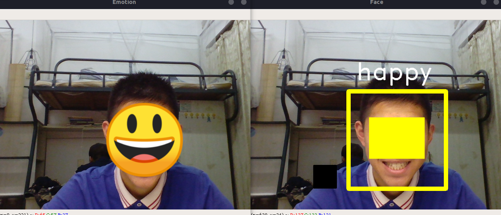
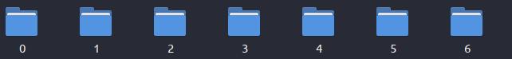
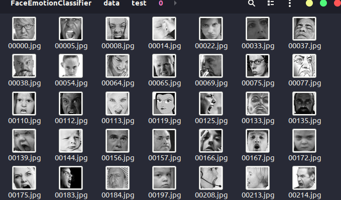

# 人脸情绪识别与emoji转换(FaceEmotionClassifier)

用Keras做前端，tensorflow做后端训练模型识别人类的情绪。根据情绪选择相应的emoji匹配 

[博客地址](https://www.zhzh.xyz/2018/12/13/emotionclassify/)

## 项目简介



- 通过opencv-python识别出人脸

- 然后用fer2013的数据集训练深度卷积神经网络构建的模型识别人脸表情

- 使用训练好的模型识别人脸的表情情绪

- 根据识别结果，匹配合适的emoji遮住人脸

## 数据集介绍

### FER2013

训练模型的数据集选用了[kaggle](https://www.kaggle.com/c/challenges-in-representation-learning-facial-expression-recognition-challenge/data)挑战赛上的fer2013数据集

下载得到的csv格式可以通过Excel看到格式为：

| Emotion | Pixels | Usage |
|------------|------------|------------|
| 0 | 4 0 170 118 101 88 88 75 78 82 66 74 68 59 63 64 65 90 89 73 80 80 85 88 95 117 … 129 | Training |
| 2 | 200 197 149 139 156 89 111 58 62 95 113 117 116 116 112 111 96 86 99 113 120 1 … 116 | Training |

所以首先打开csv文件，根据usage把数据集分为：训练集、测试集和验证集

``` python
with open(csv_file) as f:
    csv_r = csv.reader(f)
    header = next(csv_r) #Python中读取文件，指向的是文件的第一行，但是第一行是标题，所以用next()指向下一行，也就是从第二行开始
    print(header)
    rows = [row for row in csv_r]

    trn = [row[:-1] for row in rows if row[-1] == 'Training']
    csv.writer(open(train_csv, 'w+'), lineterminator='\n').writerows([header[:-1]] + trn)
    print(len(trn))

    val = [row[:-1] for row in rows if row[-1] == 'PublicTest']
    csv.writer(open(val_csv, 'w+'), lineterminator='\n').writerows([header[:-1]] + val)
    print(len(val))

    tst = [row[:-1] for row in rows if row[-1] == 'PrivateTest']
    csv.writer(open(test_csv, 'w+'), lineterminator='\n').writerows([header[:-1]] + tst)
    print(len(tst))
```

如果直接用当前数据是一个扁平的向量，没有空间局部性。用这样的数据直接进行训练，就会失去空间结构和图像关系信息。卷积神经网络可以保留空间信息，并且更适合图像分类问题，所以要把数据转为图片方便下面采用卷积神经网络进行训练



``` python
num = 1
    with open(csv_file) as f:
        csv_r = csv.reader(f)
        header = next(csv_r)
        for i, (label, pixel) in enumerate(csv_r):
            # 0 - 6 文件夹内的图片label分别为：
            # angry ，disgust ，fear ，happy ，sad ，surprise ，neutral
            pixel = np.asarray([float(p) for p in pixel.split()]).reshape(48, 48)
            sub_folder = os.path.join(save_path, label)
            if not os.path.exists(sub_folder):
                os.makedirs(sub_folder)
            im = Image.fromarray(pixel).convert('L')
            image_name = os.path.join(sub_folder, '{:05d}.jpg'.format(i))
            print(image_name)
            im.save(image_name)
```

顺便把图片灰度化处理（防止黑人和白人的肤色对模型造成影响 O(∩_∩)O哈哈哈）



### Emoji表情集

替代人脸的卡通表情采用了Android 9的Emoji


## 深度卷积神经网络模型

### 构建模型

这里用到了很多神经网络层

> 这里图像使用tf（tensorflow）顺序，它在三个通道上的形状为（48,48），正常图片可以表示为(48, 48, 3)。只不过在刚刚生成图片的时候，已经做过灰度化处理，所以这个时候，只有一个通道了。

#### 卷积阶段

使用keras添加一层二维滤波器，输出维度是32并且每个二维滤波器是1 * 1的卷积层

``` python
self.model.add(Conv2D(32, (1, 1), strides=1, padding='same', input_shape=(img_size, img_size, 1)))
```

padding='same'表示保留边界处的卷积计算结果。总共只有两种设置，这种表示输出和输入的大小相同，输入的区域边界填充为0；padding='valid'表示只对输入和滤波器完全叠加的部分做卷积运算，因而输出将会少于输入。不过讲道理，这里strides这个处理步幅已经是1了，不管设置什么都不会超过边界

使用ReLU激活函数

``` python
self.model.add(Activation('relu'))
```

然后给网络学习32个5 * 5的滤波器，也用ReLU激活。并且紧接着一个最大池化层方法

``` python
self.model.add(Conv2D(32, (5, 5), padding='same'))
self.model.add(Activation('relu'))
self.model.add(MaxPooling2D(pool_size=(2, 2)))
```

之后第二层卷积阶段和第三层卷积阶段都是用ReLU激活函数，后面再次跟着最大池化层方法。第二层仍然是32个3 * 3大小的滤波器，第三层滤波器增加到64个5 * 5，在更深的网络层增加滤波器数目是深度学习中一个普遍采用的技术

``` python
self.model.add(Conv2D(32, (3, 3), padding='same'))
self.model.add(Activation('relu'))
self.model.add(MaxPooling2D(pool_size=(2, 2)))

self.model.add(Conv2D(64, (5, 5), padding='same'))
self.model.add(Activation('relu'))
self.model.add(MaxPooling2D(pool_size=(2, 2)))
```

#### 深度管道的下一个阶段

首先用Flatten()获得一个扁平的网络

``` python
self.model.add(Flatten())
```

用ReLU激活一个有2048个神经元的隐藏层，用Dropout丢弃到一半的网络，再添加一个1024个神经元的隐藏层，跟着一个关闭50%神经元的dropout层

``` python
self.model.add(Activation('relu'))
self.model.add(Dropout(0.5))
self.model.add(Dense(1024))
self.model.add(Activation('relu'))
self.model.add(Dropout(0.5))
```

#### 输出层

添加作为输出7个类的softmax层，每个类对应一个类别

``` python
self.model.add(Dense(num_classes))
self.model.add(Activation('softmax'))
```

#### MODEL_SUMMARY

``` python
_________________________________________________________________
Layer (type)                 Output Shape              Param #   
=================================================================
conv2d_1 (Conv2D)            (None, 48, 48, 32)        64        
_________________________________________________________________
activation_1 (Activation)    (None, 48, 48, 32)        0         
_________________________________________________________________
conv2d_2 (Conv2D)            (None, 48, 48, 32)        25632     
_________________________________________________________________
activation_2 (Activation)    (None, 48, 48, 32)        0         
_________________________________________________________________
max_pooling2d_1 (MaxPooling2 (None, 24, 24, 32)        0         
_________________________________________________________________
conv2d_3 (Conv2D)            (None, 24, 24, 32)        9248      
_________________________________________________________________
activation_3 (Activation)    (None, 24, 24, 32)        0         
_________________________________________________________________
max_pooling2d_2 (MaxPooling2 (None, 12, 12, 32)        0         
_________________________________________________________________
conv2d_4 (Conv2D)            (None, 12, 12, 64)        51264     
_________________________________________________________________
activation_4 (Activation)    (None, 12, 12, 64)        0         
_________________________________________________________________
max_pooling2d_3 (MaxPooling2 (None, 6, 6, 64)          0         
_________________________________________________________________
flatten_1 (Flatten)          (None, 2304)              0         
_________________________________________________________________
dense_1 (Dense)              (None, 2048)              4720640   
_________________________________________________________________
activation_5 (Activation)    (None, 2048)              0         
_________________________________________________________________
dropout_1 (Dropout)          (None, 2048)              0         
_________________________________________________________________
dense_2 (Dense)              (None, 1024)              2098176   
_________________________________________________________________
activation_6 (Activation)    (None, 1024)              0         
_________________________________________________________________
dropout_2 (Dropout)          (None, 1024)              0         
_________________________________________________________________
dense_3 (Dense)              (None, 7)                 7175      
_________________________________________________________________
activation_7 (Activation)    (None, 7)                 0         
=================================================================
Total params: 6,912,199
Trainable params: 6,912,199
Non-trainable params: 0
_________________________________________________________________
model built
Found 28709 images belonging to 7 classes.
```

### 训练模型

#### 编译模型

这里选择随机梯度下降算法作为优化器

``` python
sgd = SGD(lr=0.01, decay=1e-6, momentum=0.9, nesterov=True)
self.model.compile(loss='categorical_crossentropy', optimizer=sgd, metrics=['accuracy'])
```

#### 通过数据增加改善性能

通常提高性能有两种方法，一种是定义一个更深、有更多卷积操作的网络，另一种训练更多的图片。这里用keras自带的ImageDataGenerator方法扩展数据集

``` python
# 自动扩充训练样本
train_datagen = ImageDataGenerator(
    rescale=1. / 255, # 归一化处理
    shear_range=0.2, # 随机缩放
    zoom_range=0.2, # 放大
    horizontal_flip=True) # 随机水平翻转
```

考虑到效率问题，keras提供了生成器针对模型的并发运行。我的理解就是CPU处理生成图像，GPU上并行进行训练

``` python
# 归一化验证集
val_datagen = ImageDataGenerator(
    rescale=1. / 255)
eval_datagen = ImageDataGenerator(
    rescale=1. / 255)
# 以文件分类名划分label
train_generator = train_datagen.flow_from_directory(
    data_path + '/train',
    target_size=(img_size, img_size),
    color_mode='grayscale',
    batch_size=batch_siz,
    class_mode='categorical')
val_generator = val_datagen.flow_from_directory(
    data_path + '/val',
    target_size=(img_size, img_size),
    color_mode='grayscale',
    batch_size=batch_siz,
    class_mode='categorical')
eval_generator = eval_datagen.flow_from_directory(
    data_path + '/test',
    target_size=(img_size, img_size),
    color_mode='grayscale',
    batch_size=batch_siz,
    class_mode='categorical')
history_fit = self.model.fit_generator(
    train_generator,
    steps_per_epoch=800 / (batch_siz / 32),  # 28709
    nb_epoch=nb_epoch,
    validation_data=val_generator,
    validation_steps=2000,
)
```

#### 保存模型结构及权重

把结构保存为JSON字串，把权重保存到HDF5文件

``` python
model_json = self.model.to_json()
with open(model_path + "/model_json.json", "w") as json_file:
    json_file.write(model_json)
self.model.save_weights(model_path + '/model_weight.h5')
self.model.save(model_path + '/model.h5')
```

## 识别模块

### 加载权重及模型结构

``` python
# 从json中加载模型
json_file = open(model_path + 'model_json.json')
loaded_model_json = json_file.read()
json_file.close()
model = model_from_json(loaded_model_json)

# 加载模型权重
model.load_weights(model_path + 'model_weight.h5')
```

### 使用OPENCV-PYTHON识别人脸

用opencv打开摄像头，使用opencv提供的一个训练好的模型识别人脸人类器

``` python
# 创建VideoCapture对象
capture = cv2.VideoCapture(0)

# 使用opencv的人脸分类器
cascade = cv2.CascadeClassifier(model_path + 'haarcascade_frontalface_alt.xml')

# 实时获得摄像头数据
ret, frame = capture.read()

# 灰度化处理
    gray = cv2.cvtColor(frame, cv2.COLOR_BGR2GRAY)

# 识别人脸位置
faceLands = cascade.detectMultiScale(gray, scaleFactor=1.1,
                                        minNeighbors=1, minSize=(120, 120))
```

### 识别人脸情绪

根据识别出的脸部特征点，裁剪出脸部图像，然后调用模型预测情绪

``` python
if len(faceLands) > 0:
    for faceLand in faceLands:
        x, y, w, h = faceLand
        images = []
        result = np.array([0.0] * num_class)

        # 裁剪出脸部图像
        image = cv2.resize(gray[y:y + h, x:x + w], (img_size, img_size))
        image = image / 255.0
        image = image.reshape(1, img_size, img_size, 1)

        # 调用模型预测情绪
        predict_lists = model.predict_proba(image, batch_size=32, verbose=1)
        result += np.array([predict for predict_list in predict_lists
                            for predict in predict_list])
        emotion = emotion_labels[int(np.argmax(result))]
        print("Emotion:", emotion)
```

根据识别结果，用cv的rectangle在视频流上框出脸部并且用putText打上标签

``` python
# 框出脸部并且写上标签
cv2.rectangle(frame, (x - 20, y - 20), (x + w + 20, y + h + 20),
                (0, 255, 255), thickness=10)
cv2.putText(frame, '%s' % emotion, (x, y - 50),
            cv2.FONT_HERSHEY_DUPLEX, 2, (255, 255, 255), 2, 30)
cv2.imshow('Face', frame)
```

### 用EMOJI盖住人脸

先在第一次获取视频画面的时候就copy一个没有灰度化处理的视频画面

``` python
# 呈现用emoji替代后的画面
    emoji_show = frame.copy()
```

直接把emoji图片遮盖人脸会出现emoji背景变为黑色盖上去了。所以这里要蒙版处理一下，也就是保持emoji透明背景的特性，当然，这里所有图像都要归一化处理

``` python
def face2emoji(face, emotion_index, position):
    x, y, w, h = position
    emotion_image = cv2.resize(emotion_images[emotion_index], (w, h))
    overlay_img = emotion_image[:, :, :3]/255.0
    overlay_bg = emotion_image[:, :, 3:]/255.0
    background = (1.0 - overlay_bg)
    face_part = (face[y:y + h, x:x + w]/255.0) * background
    overlay_part = overlay_img * overlay_bg

    face[y:y + h, x:x + w] = cv2.addWeighted(face_part, 255.0, overlay_part, 255.0, 0.0)

    return face
```
